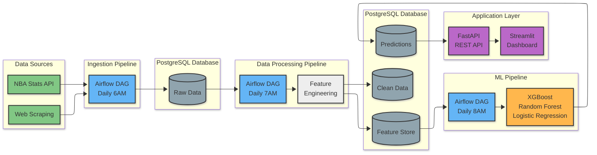

# NBA Data Pipeline & Prediction System

> 🚧 **Work in Progress** - Building a production-grade ML pipeline for NBA game predictions

## Overview

An end-to-end data engineering and machine learning system that ingests NBA game data, processes it through Apache Airflow, trains predictive models, and serves predictions through an interactive dashboard.

**Goal:** Demonstrate production-level data engineering and ML skills for landing data/ML engineering roles.

## Architecture

### System Design


### Data Flow

1. **Ingestion (Daily 6 AM):** Collect game schedules, scores, player stats, team metrics from NBA API
2. **ETL (Daily 7 AM):** Validate data quality, clean, transform, engineer features (rolling averages, head-to-head, home/away splits)
3. **ML Training (Weekly):** Train and evaluate multiple models, select best performer, store in model registry
4. **Prediction (Daily 8 AM):** Generate predictions for today's games with confidence scores
5. **Serving (Real-time):** API and dashboard provide access to predictions and analytics

## Tech Stack

| Category | Technologies |
|----------|-------------|
| **Orchestration** | Apache Airflow |
| **Data Storage** | PostgreSQL |
| **ML/Analytics** | scikit-learn, XGBoost, pandas, numpy |
| **API** | FastAPI, WebSockets |
| **Visualization** | Streamlit, Plotly |
| **DevOps** | Docker, Docker Compose |
| **Testing** | pytest |

## Features (Planned)

### Backend Pipeline
- ✅ Automated daily data ingestion
- ✅ Data quality validation and monitoring
- ✅ Feature engineering pipeline
- ✅ Multi-model training and comparison
- ✅ Prediction generation with confidence scores

### Interactive Dashboard
- 📊 Live game predictions for today's matchups
- 📈 Model performance analytics and trends
- 🔍 Team comparison and matchup analysis
- ⚙️ Pipeline health monitoring
- 📜 Historical predictions browser

### API Endpoints
- `GET /predictions/today` - Today's game predictions
- `GET /predictions/history` - Historical predictions with filters
- `GET /models/performance` - Model accuracy metrics
- `GET /teams/{team_id}/stats` - Team statistics
- `GET /pipeline/status` - DAG run status and health
- `WS /ws/live-updates` - Real-time prediction updates

## Project Status

- [x] Project architecture and design
- [x] Development environment setup
- [ ] Database schema design
- [ ] Data ingestion pipeline
- [ ] ETL and feature engineering
- [ ] Airflow DAG implementation
- [ ] ML training pipeline
- [ ] Model evaluation and selection
- [ ] REST API development
- [ ] Interactive dashboard
- [ ] Testing and validation
- [ ] Docker containerization
- [ ] Documentation and demo

## Local Development Setup

### Prerequisites
- Python 3.9+
- PostgreSQL 14+
- Docker & Docker Compose

### Installation
```bash
# Clone repository
git clone https://github.com/Daniel-Tietie/nba-data-pipeline-analytics.git
cd nba-data-pipeline-analytics

# Create virtual environment
python -m venv venv
source venv/bin/activate  # Windows: venv\Scripts\activate

# Install dependencies
pip install -r requirements.txt

# Configure environment
cp .env.example .env
# Edit .env with your database credentials

# Set up database
createdb nba_pipeline
psql -d nba_pipeline -f config/db_schema.sql

# More detailed setup instructions coming as project develops...
```

## Project Structure
```
nba-data-pipeline-analytics/
├── dags/                   # Airflow DAGs
├── src/
│   ├── ingestion/         # Data collection modules
│   ├── etl/               # Data transformation
│   ├── models/            # ML training and prediction
│   ├── api/               # FastAPI application
│   └── dashboard/         # Streamlit UI
├── tests/                 # Unit and integration tests
├── config/                # Configuration files
├── docs/                  # Documentation and architecture
└── notebooks/             # Exploratory analysis
```

## Why This Project?

This project demonstrates:
- **Data Engineering:** Building production pipelines with proper orchestration
- **ML Engineering:** End-to-end model development, training, and deployment
- **Software Engineering:** Clean code, testing, documentation, version control
- **System Design:** Scalable architecture with separation of concerns
- **DevOps:** Containerization and deployment best practices

## Future Enhancements

- Real-time game updates during live games
- Advanced models (neural networks, ensemble methods)
- Player prop predictions (points, rebounds, assists)
- Betting odds integration and value analysis
- Kubernetes deployment for cloud scalability
- CI/CD pipeline with GitHub Actions

## License

MIT License - See LICENSE file for details

## Contact

**Daniel Tietie**  
GitHub: [@Daniel-Tietie](https://github.com/Daniel-Tietie)

---

*Last updated: October 24, 2025*