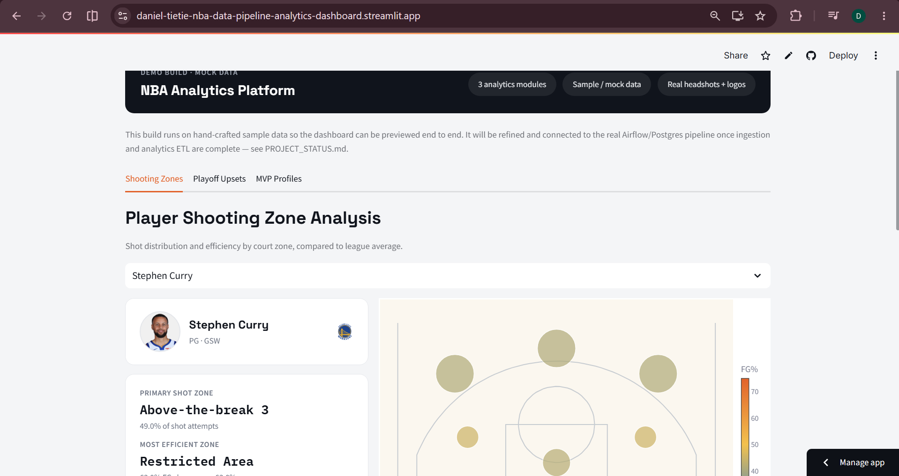
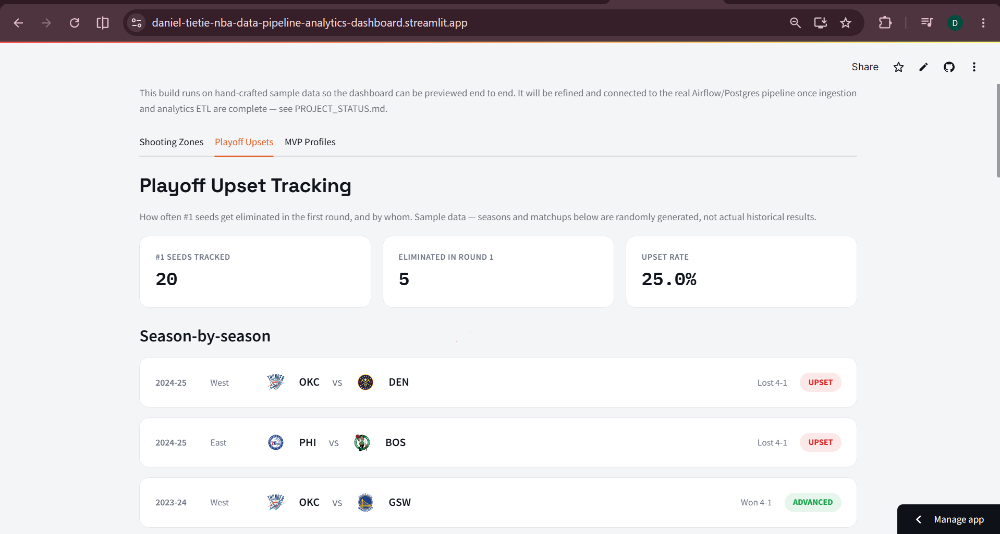
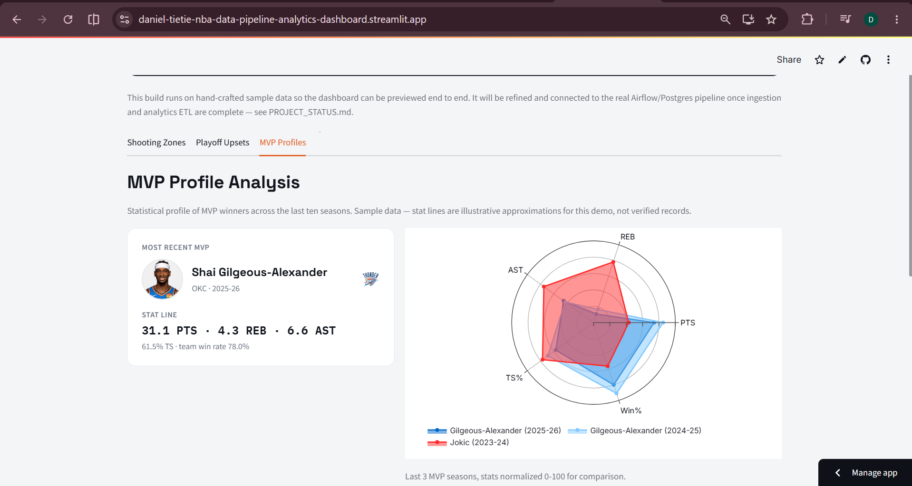

# NBA Analytics Platform
------
### Live demo (mock/draft build)

[https://daniel-tietie-nba-data-pipeline-analytics-dashboard.streamlit.app/](https://daniel-tietie-nba-data-pipeline-analytics-dashboard.streamlit.app/)


**Note:** this is a mock/draft dashboard running on hand-crafted sample data, not the real pipeline data. Player headshots and team logos are real, but the surrounding stats are illustrative placeholders meant to preview the three analytics modules end to end. It will be updated on top of the live Airflow/Postgres pipeline once ingestion and analytics ETL are complete.

--------------------------------

An end-to-end data engineering project that ingests NBA game and player data, processes it through a layered PostgreSQL pipeline orchestrated by Apache Airflow, and serves three analytical modules through an interactive Streamlit dashboard.

**Goal:** Demonstrate production-level data engineering skills -- pipeline orchestration, layered data modeling, and data quality validation -- for data engineering and analytics roles.

## Overview

This project answers three specific basketball questions using real NBA data rather than building generic predictive models:

1. How does a player's shot distribution and efficiency vary across court zones, compared to other players?
2. How often does the NBA's #1 seed get eliminated in the first round of the playoffs, and by whom?
3. What statistical profile tends to produce an MVP, across the last ten seasons?

## Data Flow

1. **Ingestion** -- collect game data, team stats, player season stats, shot zone splits, and standings from the NBA Stats API
2. **Processing** -- validate, clean, and load into a layered PostgreSQL schema (raw → processed → analytics)
3. **Analytics ETL** -- transform processed data into the three module-specific outputs
4. **Serving** -- a Streamlit dashboard reads directly from the analytics layer and renders interactive Plotly visualizations

## Tech Stack

| Category | Technologies |
|----------|-------------|
| **Orchestration** | Apache Airflow |
| **Data Storage** | PostgreSQL |
| **Data Processing** | Python, pandas |
| **Visualization** | Streamlit, Plotly |
| **DevOps** | Docker, Docker Compose |
| **Testing** | pytest |

## Analytics Modules

### 1. Player Shooting Zone Analysis
Compares shot distribution and efficiency across court zones (restricted area, paint, mid-range, corner three, above-the-break three) for any player and season -- for example, Stephen Curry's reliance on above-the-break threes versus drives to the basket, compared against other players.

### 2. Playoff Upset Tracking
Identifies #1 seeds eliminated in the first round of the playoffs using historical seeding and series results, to see how often the league's best regular-season teams fail to convert in the postseason.

### 3. MVP Profile Analysis
Tracks the statistical profile of MVP winners across the last ten seasons -- scoring, rebounding, assists, shooting efficiency, team win percentage -- to surface what statistical patterns tend to produce an MVP.

A personal stats module is planned as a fourth addition once my own game data is digitized.

### Screenshots (mock/draft build)





## Data Quality & Cleaning

This project maintains data quality standards through systematic validation and documented cleaning decisions.

**Final Dataset:**
- 3,691 NBA regular season games (2021–2024)
- 30 official NBA teams
- No missing data/records since it is directly from NBA API

For detailed data cleaning documentation, see [`docs/DATA_CLEANING.md`](docs/DATA_CLEANING.md).

## Project Status

- [x] Database schema design (layered raw → processed → analytics architecture)
- [x] Historical game ingestion (3,691 games across 3 seasons)
- [x] Schema pivot -- removed ML scope, added analytics tables and migration path
- [ ] Ingestion scripts for standings, player season stats, shot zone splits
- [ ] Analytics ETL for the three modules
- [ ] Airflow DAG orchestration
- [x] Streamlit dashboard (mock/draft build on sample data -- live pipeline integration pending)
- [ ] Docker containerization
- [ ] Personal stats module

## Local Development Setup

### Prerequisites
- Python 3.9+
- PostgreSQL 14+
- Docker & Docker Compose

### Installation
```bash
# Clone repository
git clone https://github.com/Daniel-Tietie/nba-data-pipeline-analytics.git
cd nba-data-pipeline-analytics

# Create virtual environment
python -m venv venv
source venv/bin/activate  # Windows: venv\Scripts\activate

# Install dependencies
pip install -r requirements.txt

# Configure environment
cp .env.example .env
# Edit .env with your database credentials

# Set up database (fresh install)
createdb nba_pipeline
psql -d nba_pipeline -f config/db_schema.sql

# If you already have data ingested, run the migration instead of the
# fresh schema file — see config/migrations/
psql -d nba_pipeline -f config/migrations/002_pivot_to_analytics.sql
```

See [`PROJECT_STATUS.md`](PROJECT_STATUS.md) for the current state of the project and what's being worked on next.

## Project Structure
```
nba-analytics-platform/
├── dags/                   # Airflow DAGs
├── src/
│   ├── ingestion/         # Data collection modules
│   ├── etl/               # Data transformation and analytics ETL
│   └── dashboard/         # Streamlit UI
├── tests/                 # Unit and integration tests
├── config/                # Schema, migrations, configuration
├── docs/                  # Documentation
└── notebooks/             # Exploratory analysis
```
