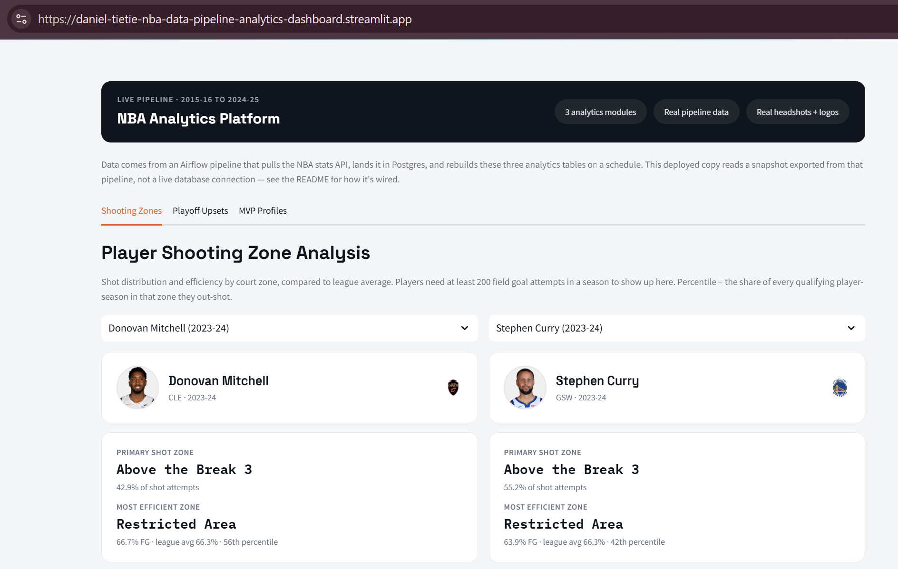
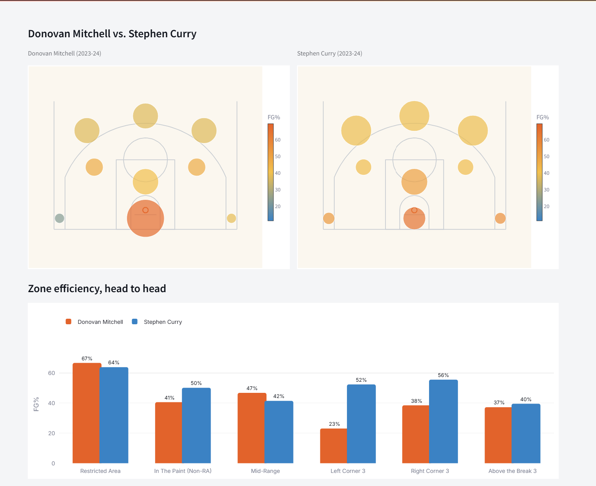
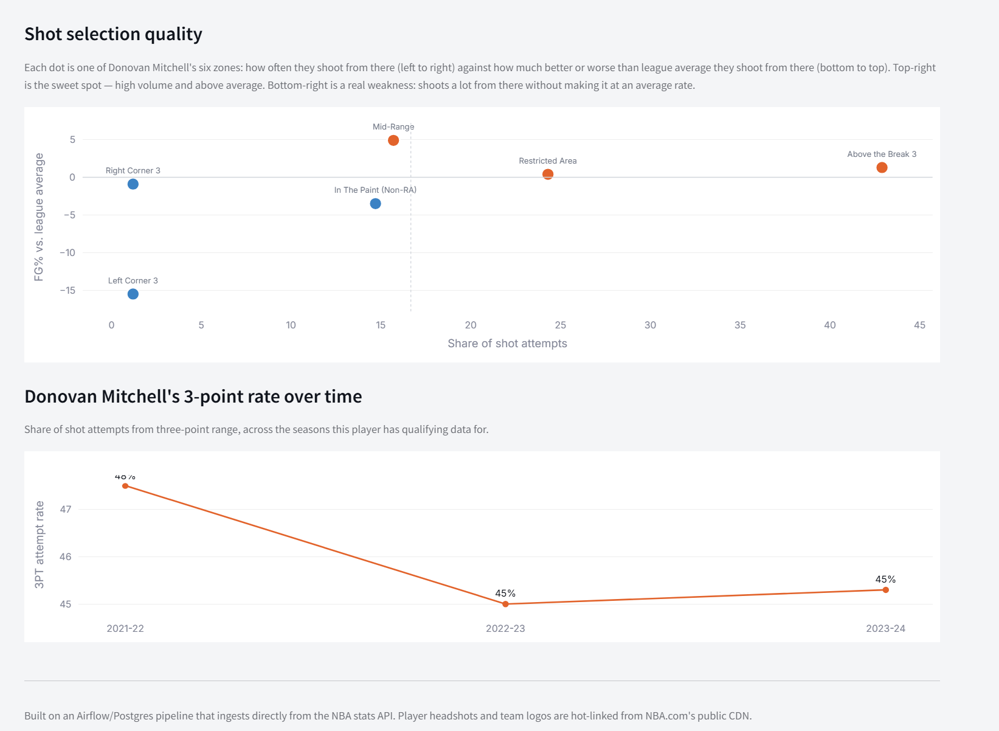
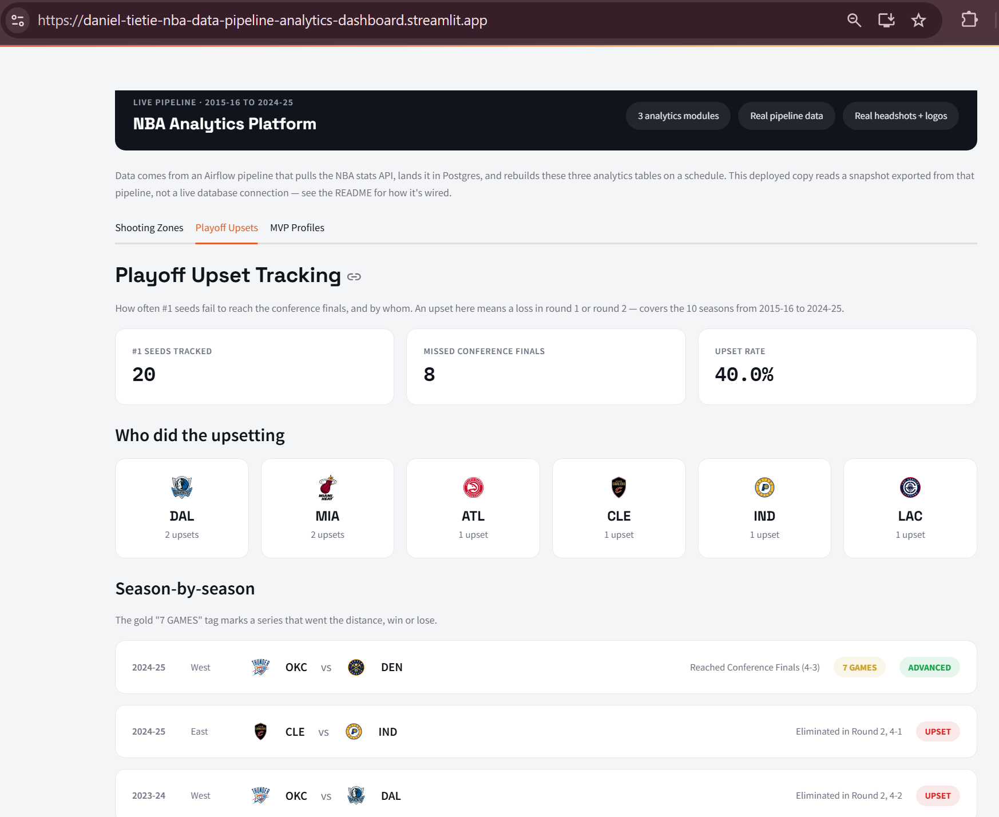
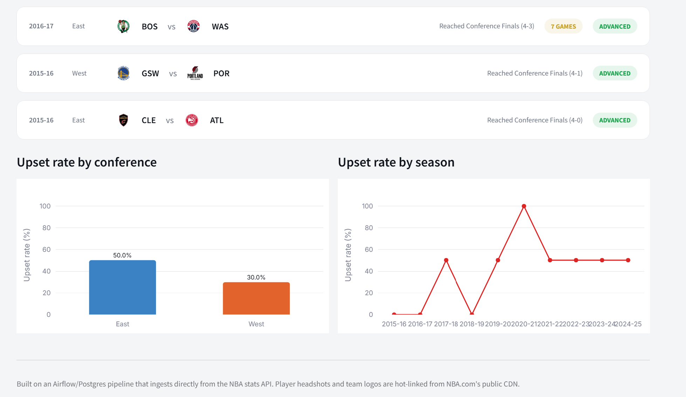
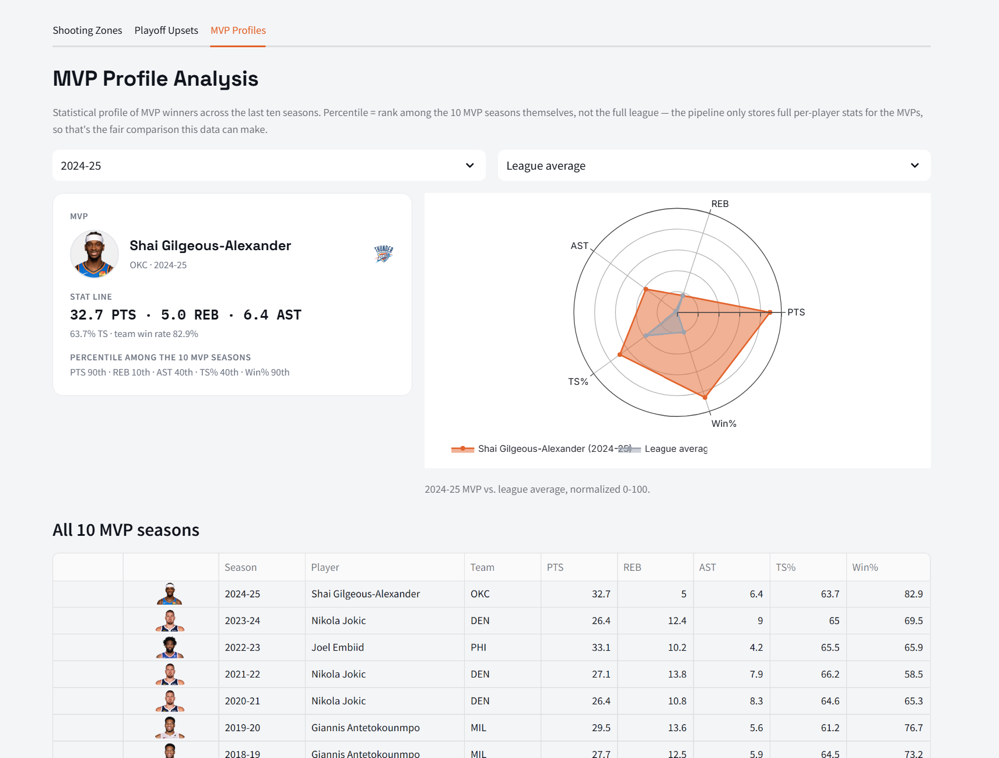
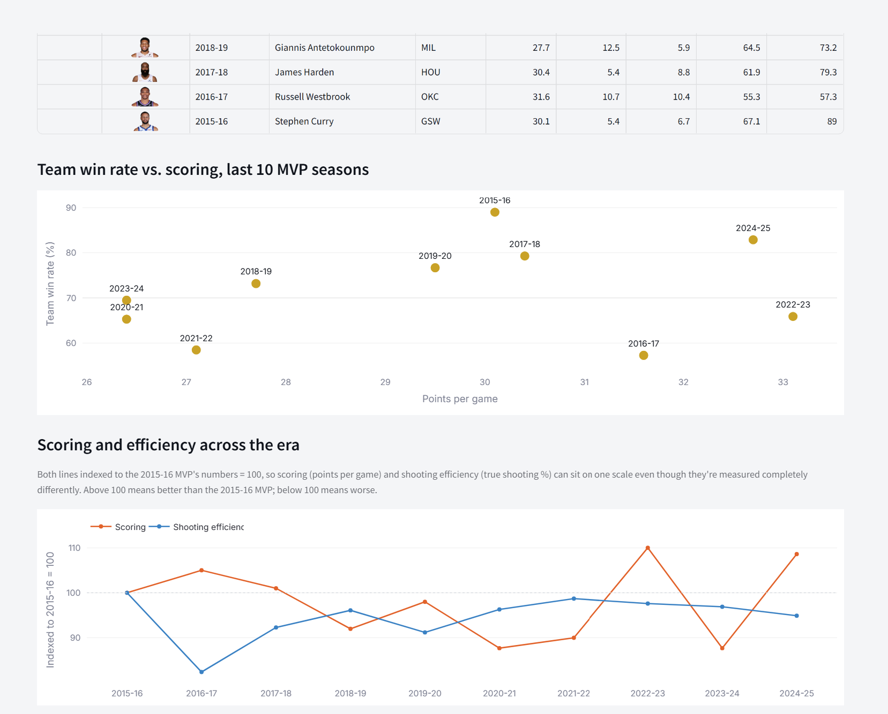
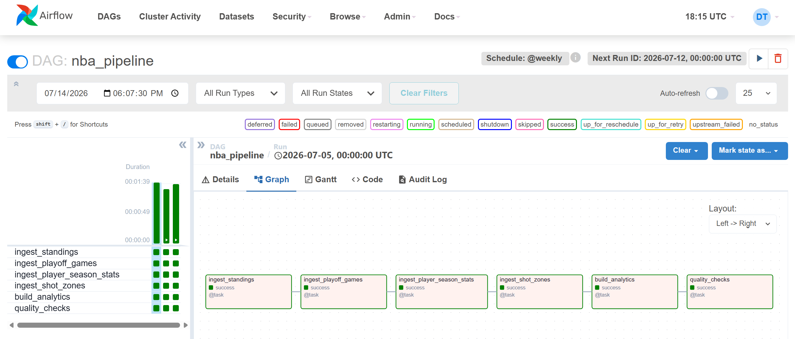

# NBA Analytics Platform
------
### Live demo

[https://daniel-tietie-nba-data-pipeline-analytics-dashboard.streamlit.app/](https://daniel-tietie-nba-data-pipeline-analytics-dashboard.streamlit.app/)

Reads real data exported from the pipeline described below. Streamlit Community Cloud can't reach a local Postgres instance, so the deployed copy serves a SQLite snapshot instead of a live database connection -- see "Running the Pipeline" for how that's wired and how to update it.

--------------------------------

An end-to-end data engineering project that ingests NBA game and player data, processes it through a layered PostgreSQL pipeline orchestrated by Apache Airflow, and serves three analytical modules through an interactive Streamlit dashboard.

**Why this exists:** I wanted to show I can handle the parts of data engineering that don't show up in a notebook -- pulling real data from an API that actively blocks scrapers, designing a schema that survives a scope change, and catching data quality issues before they reach a dashboard. Built for data engineering and analytics job applications.

## Overview

This project answers three specific basketball questions using real NBA data rather than building generic predictive models:

1. How does a player's shot distribution and efficiency vary across court zones, compared to other players?
2. How often does the NBA's #1 seed fail to reach the conference finals, and by whom?
3. What statistical profile tends to produce an MVP, across the last ten seasons?

## Data Flow

1. **Ingestion** -- collect game data, team stats, player season stats, shot zone splits, and standings from the NBA Stats API
2. **Processing** -- validate, clean, and load into a layered PostgreSQL schema (raw → processed → analytics)
3. **Analytics ETL** -- transform processed data into the three module-specific outputs
4. **Serving** -- a Streamlit dashboard reads directly from the analytics layer and renders interactive Plotly visualizations

## Tech Stack

| Category | Technologies |
|----------|-------------|
| **Orchestration** | Apache Airflow |
| **Data Storage** | PostgreSQL |
| **Data Processing** | Python, pandas |
| **Visualization** | Streamlit, Plotly |
| **DevOps** | Docker, Docker Compose |
| **Testing** | pytest |

## Analytics Modules

### 1. Player Shooting Zone Analysis
Compares shot distribution and efficiency across court zones (restricted area, paint, mid-range, corner three, above-the-break three) for any player and season -- for example, Stephen Curry's reliance on above-the-break threes versus drives to the basket, compared against other players.

### 2. Playoff Upset Tracking
Identifies #1 seeds that fail to reach the conference finals (a round-1 or round-2 exit) using historical seeding and series results, to see how often the league's best regular-season teams fall short in the postseason.

### 3. MVP Profile Analysis
Tracks the statistical profile of MVP winners across the last ten seasons -- scoring, rebounding, assists, shooting efficiency, team win percentage -- to see what these players actually have in common.

A personal stats module is planned as a fourth addition once my own game data is digitized.

### Screenshots

**Player Shooting Zone Analysis** -- comparison mode, side-by-side courts, and shot selection quality




**Playoff Upset Tracking** -- season-by-season results and upset rate trends



**MVP Profile Analysis** -- radar comparison and full season table



## Data Quality & Cleaning

Data issues get caught, documented, and fixed instead of quietly ignored. Four real issues found so far, from invalid team IDs to a seed-numbering quirk in the NBA's own standings API, are written up in detail in the file below.

**Final Dataset:**
- 3,691 NBA regular season games (2021 to 2024)
- 30 official NBA teams
- Zero missing records after cleaning (see Issue 1 in DATA_CLEANING.md)

For detailed data cleaning documentation, see [`docs/DATA_CLEANING.md`](docs/DATA_CLEANING.md).

## Project Status

- [x] Database schema design (layered raw → processed → analytics architecture)
- [x] Historical game ingestion (3,691 games across 3 seasons)
- [x] Schema pivot -- removed ML scope, added analytics tables and migration path
- [x] Ingestion scripts for standings, player season stats, shot zone splits, and playoff game logs
- [x] Analytics ETL for the three modules
- [x] Airflow DAG orchestration
- [x] Streamlit dashboard reading real pipeline data, locally and deployed
- [x] Docker containerization
- [ ] Personal stats module

## Local Development Setup

### Prerequisites
- Python 3.9+
- PostgreSQL 14+
- Docker & Docker Compose

### Installation
```bash
# Clone repository
git clone https://github.com/Daniel-Tietie/nba-data-pipeline-analytics.git
cd nba-data-pipeline-analytics

# Create virtual environment
python -m venv venv
source venv/bin/activate  # Windows: venv\Scripts\activate

# Install dependencies
pip install -r requirements.txt

# Configure environment
cp .env.example .env
# Edit .env with your database credentials

# Set up database (fresh install)
createdb nba_pipeline
psql -d nba_pipeline -f config/db_schema.sql

# If you already have data ingested, run the migration instead of the
# fresh schema file -- see config/migrations/
psql -d nba_pipeline -f config/migrations/002_pivot_to_analytics.sql
```

## Running the Pipeline

Airflow doesn't run natively on Windows, so the DAG runs in Docker Compose:
LocalExecutor, one webserver, one scheduler. The Postgres container in the
compose file is Airflow's own metadata database, not the pipeline's data --
the DAG's tasks connect out to the existing local `nba_pipeline` Postgres via
`host.docker.internal`, reusing the credentials already in `.env`.

```bash
# Build the Airflow image and start webserver + scheduler
docker compose up --build

# Airflow UI at http://localhost:8080 (admin / admin)
# Trigger the "nba_pipeline" DAG from there, or from the CLI:
docker compose exec airflow-scheduler airflow dags trigger nba_pipeline

# Stop everything
docker compose down
```

The DAG (`dags/nba_pipeline_dag.py`) runs ingestion for the four raw tables,
rebuilds the three analytics tables, then gates on `data_quality_checks`:

```
ingest_standings >> ingest_playoff_games >> ingest_player_season_stats
  >> ingest_shot_zones >> build_analytics >> quality_checks
```

Each task imports and calls the same functions the standalone ingestion and
ETL scripts use, so `python -m src.ingestion.ingest_standings` and the DAG
task run identical code. Every run is recorded in the `dag_runs` table.

A real run, all six tasks green:



## Project Structure
```
nba-analytics-platform/
├── dags/                   # Airflow DAGs
├── src/
│   ├── ingestion/         # Data collection modules
│   ├── etl/               # Data transformation and analytics ETL
│   └── dashboard/         # Streamlit UI
├── tests/                 # Unit and integration tests
├── config/                # Schema, migrations, configuration
├── docs/                  # Documentation
└── notebooks/             # Exploratory analysis
```
